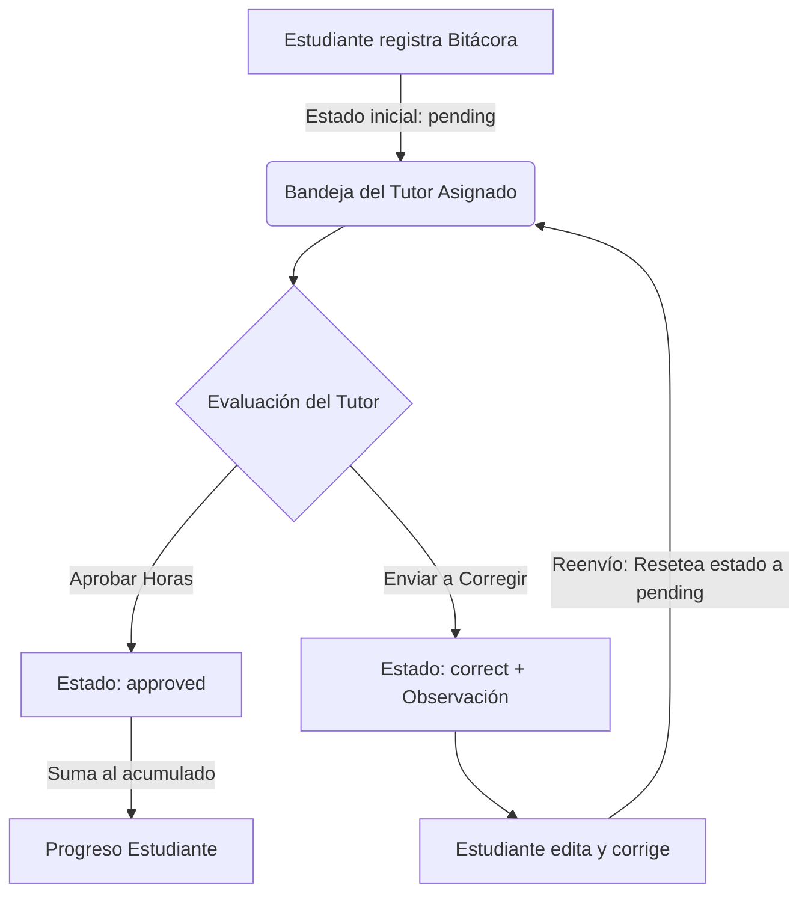

# Documentación del Sistema de Control de Servicio Comunitario - UNEFA

Este documento detalla la estructura, lógica y funcionamiento de todos los componentes del proyecto **Control de Servicio Comunitario**, desarrollado para la **Universidad Nacional Experimental Politécnica de la Fuerza Armada Nacional Bolivariana (UNEFA)**. El sistema está diseñado bajo una arquitectura cliente-servidor desacoplada para registrar, supervisar y auditar de forma interactiva las actividades comunitarias de los estudiantes.

---

## 1. Arquitectura General y Estructura del Proyecto

El proyecto se divide en dos directorios principales:
1.  **`client` (Frontend)**: Desarrollado en React, compilado con Vite y estilizado mediante CSS moderno (Glassmorphism y micro-animaciones).
2.  **`server` (Backend)**: API REST construida con Node.js y Express, comunicada con una base de datos relacional PostgreSQL.

### Árbol de Directorios del Proyecto

```text
Control Proyectos comunitarios/
├── client/                     # Código del Frontend (React + Vite)
│   ├── public/                 # Recursos públicos estáticos
│   ├── src/
│   │   ├── assets/             # Imágenes y logos
│   │   ├── components/         # Componentes y Dashboards de la interfaz
│   │   │   ├── CoordinatorDashboard.jsx  # Interfaz del Coordinador General
│   │   │   ├── Header.jsx                # Encabezado dinámico de sesión
│   │   │   ├── Login.jsx                 # Pantalla de Login Premium
│   │   │   ├── StudentDashboard.jsx      # Interfaz del Estudiante
│   │   │   └── TutorDashboard.jsx        # Interfaz de Supervisión del Tutor
│   │   ├── App.css             # Estilos de componentes específicos
│   │   ├── App.jsx             # Contenedor principal y enrutador lógico
│   │   ├── index.css           # Hoja de estilos global, tokens y Glassmorphism
│   │   └── main.jsx            # Punto de entrada de React
│   ├── index.html              # Plantilla HTML base
│   ├── package.json            # Dependencias del cliente (React, FontAwesome, etc.)
│   └── vite.config.js          # Configuración de Vite
├── server/                     # Código del Backend (Node.js + Express)
│   ├── db/
│   │   ├── index.js            # Configuración del Pool de PostgreSQL (pg)
│   │   └── schema.sql          # Estructura e inserciones semilla de la base de datos
│   ├── middleware/
│   │   └── auth.js             # Middlewares de seguridad (Validación JWT y Roles)
│   ├── routes/                 # Controladores y Endpoints de la API
│   │   ├── admin.js            # Operaciones administrativas del Coordinador
│   │   ├── auth.js             # Registro, Login y verificación del token
│   │   ├── cronograma.js       # Consulta del calendario académico
│   │   ├── proyectos.js        # Buscador de proyectos históricos
│   │   ├── reportes.js         # Creación, edición y evaluación de bitácoras
│   │   └── tutor.js            # Consulta de estudiantes asignados al tutor
│   ├── .env                    # Configuración de variables de entorno
│   ├── package.json            # Dependencias del servidor (Express, pg, JWT, Bcrypt)
│   └── server.js               # Punto de entrada y servidor Express
└── DOCUMENTACION.md            # Este documento explicativo
```

---

## 2. Esquema y Estructura de la Base de Datos (PostgreSQL)

El archivo [`server/db/schema.sql`](file:///c:/Users/Maria%20Vasquez/Desktop/Control%20Proyectos%20comunitarios/server/db/schema.sql) define la estructura de las tablas de datos para el motor PostgreSQL 17:

### Tabla: `users`
Almacena la información de todos los usuarios (Estudiantes, Tutores y Coordinadores).
*   `id` (SERIAL PRIMARY KEY): Identificador único.
*   `name` (VARCHAR): Nombre completo del usuario.
*   `identification` (VARCHAR UNIQUE): Cédula de identidad nacional (clave de inicio de sesión).
*   `major` (VARCHAR): Carrera a la que pertenece el usuario.
*   `role` (VARCHAR): Rol en el sistema, limitado mediante `CHECK` a: `'student'` (estudiante), `'tutor'` (tutor académico) o `'coordinator'` (coordinador general).
*   `password_hash` (VARCHAR): Contraseña encriptada unidireccionalmente con `bcrypt`.
*   `active` (BOOLEAN DEFAULT TRUE): Estado de la cuenta (permite dar de baja usuarios sin borrar su historial).
*   `tutor_id` (INTEGER REFERENCES `users(id)`): Relación reflexiva que vincula a un estudiante con su tutor asignado.

### Tabla: `activities`
Almacena el registro individual (bitácoras) de horas de servicio comunitario cargadas por los estudiantes.
*   `id` (SERIAL PRIMARY KEY): Identificador único de la actividad.
*   `student_id` (INTEGER REFERENCES `users(id)`): Referencia al estudiante que ejecutó la labor.
*   `activity_date` (DATE): Fecha en que se realizó la actividad.
*   `hours_spent` (INTEGER): Cantidad de horas invertidas, validado mediante `CHECK` entre 1 y 8 horas diarias.
*   `description` (TEXT): Resumen descriptivo de la tarea comunitaria realizada.
*   `physical_attendance` (BOOLEAN): Indica si la actividad fue presencial en la comunidad (`TRUE`) o a distancia (`FALSE`).
*   `spokesperson_name` (VARCHAR) & `spokesperson_phone` (VARCHAR): Datos de contacto del Vocero Comunal (bloque de Aval Comunitario para auditorías).
*   `sworn_statement` (BOOLEAN): Declaración jurada obligatoria aceptada por el alumno (`CHECK = TRUE`).
*   `status` (VARCHAR DEFAULT 'pending'): Estado de evaluación del reporte, restringido a:
    *   `'pending'`: Registrada por el estudiante, en espera de revisión del tutor.
    *   `'approved'`: Aprobada por el tutor. Las horas se suman al progreso formal del alumno.
    *   `'correct'`: Rechazada por observaciones. Requiere corrección y reenvío por parte del estudiante.
*   `feedback_comment` (TEXT): Observación o comentario escrito por el tutor detallando los motivos de una corrección.

### Tabla: `milestones`
Almacena los hitos del cronograma académico (fechas límite e inducciones).
*   `id` (SERIAL PRIMARY KEY)
*   `title` (VARCHAR): Título del hito.
*   `event_date` (DATE): Fecha pautada para el evento.

### Tabla: `historical_projects`
Repositorio de proyectos antiguos para consulta y orientación.
*   `id` (SERIAL PRIMARY KEY)
*   `title` (VARCHAR): Título del proyecto comunitario aprobado.
*   `community` (VARCHAR): Ubicación o comunidad beneficiada.
*   `major` (VARCHAR): Carrera del estudiante que desarrolló el proyecto.
*   `summary` (TEXT): Resumen analítico del trabajo realizado.
*   `academic_year` (INTEGER): Año de culminación.

---

## 3. Seguridad, Lógica de Negocio y Flujo de Trabajo

### A. Autenticación y Autorización (JWT + Roles)
*   **Encriptación**: En el registro, la contraseña es procesada por `bcryptjs` con un factor de costo (`salt`) de 10.
*   **Generación del Token**: Al iniciar sesión con éxito en `/api/auth/login`, el servidor genera un **JSON Web Token (JWT)** que encapsula la información del usuario (ID, nombre, rol y carrera), firmado con una clave secreta (`JWT_SECRET`) y con un tiempo de expiración de 24 horas.
*   **Intercepción**: El cliente almacena este token en el `localStorage`. En cada petición posterior a la API, el token se envía en las cabeceras HTTP (`Authorization: Bearer <token>`).
*   **Validación**: El middleware [`server/middleware/auth.js`](file:///c:/Users/Maria%20Vasquez/Desktop/Control%20Proyectos%20comunitarios/server/middleware/auth.js) intercepta la petición, valida la autenticidad del token y extrae los datos del usuario. Adicionalmente, el middleware `checkRole` restringe el acceso de endpoints específicos comparando el rol activo del usuario contra los roles permitidos.

### B. Flujo de Control de Bitácoras (Estudiante <-> Tutor)
El proceso principal de aprobación de las 120 horas legales de servicio comunitario funciona de la siguiente manera:



1.  **Registro**: El estudiante envía una nueva actividad. El backend valida que los campos estén completos, que las horas estén en el rango de 1 a 8, y que se haya aceptado la declaración jurada. Se guarda en base de datos con estado `'pending'`.
2.  **Supervisión**: El tutor accede a su lista de alumnos asignados. A través de agregaciones en PostgreSQL (`SUM()`), visualiza el avance real acumulado de cada estudiante (solo sumando horas `'approved'`).
3.  **Acciones del Tutor**:
    *   **Aprobación**: Marca la bitácora como `'approved'`. Las horas reportadas se consolidan en el total del estudiante.
    *   **Observación**: Si la descripción no es lo suficientemente explícita, marca la bitácora como `'correct'` e ingresa un comentario con la observación.
4.  **Corrección**: El estudiante observa las observaciones en color rojo en su historial, activa el botón de "Editar y Corregir", lo que carga los datos en el formulario para modificarlos. Al guardar los cambios, la bitácora se actualiza, el estado vuelve a `'pending'` y el comentario de feedback se limpia (`NULL`) para una nueva revisión del tutor.

---

## 4. Componentes del Frontend (React + CSS)

Las interfaces del sistema son altamente reactivas y adaptadas para cada tipo de actor en la plataforma:

### A. Enrutador y Sesión: [`client/src/App.jsx`](file:///c:/Users/Maria%20Vasquez/Desktop/Control%20Proyectos%20comunitarios/client/src/App.jsx)
Es el núcleo del cliente. Al cargarse, busca si existe un token en el `localStorage`. Si lo encuentra, realiza una petición de verificación `/api/auth/me` para recuperar los datos de sesión del usuario.
*   Si la sesión no existe, renderiza el componente `<Login />`.
*   Si la sesión es válida, monta el `<Header />` y renderiza de forma condicional el Dashboard correspondiente al rol (`student` -> `<StudentDashboard />`, `tutor` -> `<TutorDashboard />`, `coordinator` -> `<CoordinatorDashboard />`).

### B. Login: [`client/src/components/Login.jsx`](file:///c:/Users/Maria%20Vasquez/Desktop/Control%20Proyectos%20comunitarios/client/src/components/Login.jsx)
Pantalla de autenticación diseñada con efectos visuales premium (Glassmorphism, desenfoques de fondo y degradados radiales oscuros). Controla de manera interactiva los estados de carga y reporta de inmediato cualquier error de conexión o credenciales erróneas.

### C. Header: [`client/src/components/Header.jsx`](file:///c:/Users/Maria%20Vasquez/Desktop/Control%20Proyectos%20comunitarios/client/src/components/Header.jsx)
Barra superior pegajosa (`sticky`) que contiene el isotipo institucional de la UNEFA, el nombre del usuario autenticado, un tag dinámico que representa el rol del usuario (con iconos alusivos) y el botón para cerrar la sesión activa de forma segura.

### D. Panel del Estudiante: [`client/src/components/StudentDashboard.jsx`](file:///c:/Users/Maria%20Vasquez/Desktop/Control%20Proyectos%20comunitarios/client/src/components/StudentDashboard.jsx)
Este panel se divide en varias secciones funcionales:
*   **Contadores de Horas**: Resumen de horas aprobadas (verde), pendientes (amarillo) y por corregir (rojo).
*   **Barra de Progreso**: Muestra visualmente el avance hacia la meta de 120 horas mediante un indicador interactivo enriquecido con una animación de destello lineal (`progress-shimmer`).
*   **Formulario de Registro/Edición**: Interfaz reactiva con switches interactivos para la asistencia presencial, un bloque para ingresar los datos del aval de la comunidad y la casilla de declaración jurada obligatoria.
*   **Historial de Bitácoras**: Listado de bitácoras del estudiante con colores según su estado de aprobación. Si una bitácora tiene observaciones, despliega un cuadro de advertencia y el botón de edición.
*   **Visor de Hitos**: Línea de tiempo que refleja el cronograma académico estipulado por el coordinador.
*   **Repositorio de Proyectos**: Buscador en tiempo real con filtro por aproximación tipográfica que permite a los estudiantes buscar y guiarse con proyectos de años pasados.

### E. Panel del Tutor: [`client/src/components/TutorDashboard.jsx`](file:///c:/Users/Maria%20Vasquez/Desktop/Control%20Proyectos%20comunitarios/client/src/components/TutorDashboard.jsx)
Estructurado en un diseño de dos columnas:
*   **Columna Izquierda (Monitoreo de Alumnos)**: Muestra una tarjeta por cada alumno bajo la tutoría académica del usuario, indicando su nombre, cédula y una barra de progreso que refleja su nivel de avance hacia las 120 horas.
*   **Columna Derecha (Bandeja de Entrada)**: Listado de bitácoras pendientes de evaluación enviadas por los alumnos. Al hacer clic sobre cualquier elemento de la lista, se carga el detalle en la sección derecha, permitiendo al tutor escribir comentarios en un cuadro de texto y decidir entre aprobar la actividad o solicitar correcciones.

### F. Panel del Coordinador: [`client/src/components/CoordinatorDashboard.jsx`](file:///c:/Users/Maria%20Vasquez/Desktop/Control%20Proyectos%20comunitarios/client/src/components/CoordinatorDashboard.jsx)
Módulo centralizado para el administrador del sistema:
*   **Widgets de Métricas**: Indicadores de cantidad total de alumnos en el sistema, proyectos activos e historias de éxito (alumnos con 120 horas acumuladas).
*   **Gestión de Usuarios (CRUD)**: Formulario dinámico para registrar o editar usuarios. Permite cambiar contraseñas, definir el rol del usuario, asignar a estudiantes su tutor correspondiente y alternar su estado activo/inactivo (`toggle active`).
*   **Gestión del Cronograma**: Permite crear nuevos hitos de calendario académico especificando fecha de ejecución e inducción o eliminar hitos antiguos.
*   **Acciones de Reporte y Exportación**:
    *   *Exportación CSV*: Genera un archivo con codificación UTF-8 compatible con Microsoft Excel, que consolida todas las bitácoras cargadas en el sistema para auditorías externas.
    *   *Actas Imprimibles*: Utiliza estilos específicos para la impresión. Oculta el entorno web y activa una plantilla de reporte formal membretado de la UNEFA, el cual incluye tablas de datos y líneas de firma oficial para la Coordinadora Rosa Camejo y el Decano del núcleo.

---

## 5. Endpoints y Lógica del Servidor (API REST)

El backend expone una serie de endpoints estructurados por módulos:

### Módulo: Autenticación (`/api/auth`)
*   `POST /register`: Registra un usuario nuevo en el sistema. Valida unicidad de la cédula y realiza el hash de la contraseña.
*   `POST /login`: Valida las credenciales del usuario. Si es correcto, firma y devuelve un token JWT junto a los datos básicos del usuario.
*   `GET /me`: Middleware-protegido. Devuelve los datos actualizados del usuario titular del token enviado en la petición.

### Módulo: Reportes y Bitácoras (`/api/reportes`)
*   `GET /estudiante`: (Estudiante) Retorna el listado de actividades del alumno autenticado y ejecuta consultas agregadas para calcular sus totales de horas (aprobadas, pendientes, por corregir).
*   `POST /`: (Estudiante) Agrega una nueva actividad en base de datos.
*   `PUT /:id`: (Estudiante) Modifica una actividad siempre que su estado sea `'correct'`. Actualiza los campos y cambia el estado a `'pending'`.
*   `PUT /:id/comentario`: (Tutor) Permite a un tutor cambiar el estado de una actividad a `'approved'` o `'correct'` e insertar el comentario de observación respectivo. Valida que el estudiante de la actividad esté asignado formalmente a dicho tutor en la base de datos.

### Módulo: Cronograma (`/api/cronograma`)
*   `GET /`: Retorna la lista de hitos académicos registrados por la institución, ordenados de forma ascendente por fecha.

### Módulo: Proyectos Históricos (`/api/proyectos-historicos`)
*   `GET /`: Permite realizar búsquedas mediante parámetros de consulta (`?query=...`) que filtran proyectos históricos por su título, carrera, comunidad o resumen.

### Módulo: Tutorías (`/api/estudiantes`)
*   `GET /asignados`: (Tutor) Consulta y devuelve los estudiantes asignados a un tutor en particular y todas las bitácoras de actividades asociadas a ellos.

### Módulo: Administración (`/api/admin`)
*   `GET /usuarios`: Obtiene la lista completa de todos los usuarios registrados para el panel de administración.
*   `POST /usuarios`: Crea un usuario en el sistema. Si la contraseña se omite, se le asigna la clave por defecto `"unefa123"`.
*   `PUT /usuarios/:id`: Modifica la información del usuario (nombre, cédula, carrera, rol, tutor académico y contraseña opcional).
*   `PUT /usuarios/:id/toggle`: Cambia el estado de activación del usuario (`active`).
*   `POST /cronograma`: Crea un nuevo hito en la agenda académica.
*   `DELETE /cronograma/:id`: Remueve un hito de la agenda.
*   `GET /stats`: Ejecuta consultas de agregación consolidadas en base de datos para mostrar las estadísticas globales.
*   `GET /reportes`: Obtiene todas las bitácoras del sistema con cruce de nombres y datos de estudiantes para exportar y auditar.

---

## 6. Sistema de Diseño Estético y Visual (CSS)

La hoja de estilos principal [`client/src/index.css`](file:///c:/Users/Maria%20Vasquez/Desktop/Control%20Proyectos%20comunitarios/client/src/index.css) define la identidad gráfica premium de la plataforma:

*   **Identidad Institucional (Colores UNEFA)**: Combina un azul marino imperial (`#0C2340`) y un dorado metálico curado (`#C5A059`) junto a una paleta secundaria de escala de grises y estados.
*   **Tipografía Moderna**: Implementa las fuentes de Google Fonts **Outfit** (con peso extra-negrita de 800 y 900 para títulos jerárquicos) e **Inter** (para textos informativos y cuerpo de lectura cómodo).
*   **Glassmorphism Premium**: Se definen las clases `.glass-panel` y `.glass-card` con propiedades de translucidez y desenfoque:
    ```css
    background: rgba(255, 255, 255, 0.85);
    backdrop-filter: blur(12px);
    border: 1px solid rgba(255, 255, 255, 0.5);
    box-shadow: 0 8px 32px 0 rgba(12, 35, 64, 0.1);
    ```
*   **Animación de Carga e Indicadores**: Las barras de progreso incluyen una animación por fotogramas (`@keyframes progress-shimmer`) que genera un efecto de destello en movimiento para representar interactividad y fluidez.
*   **Diseño para Impresión Actas y PDF**: Se configura una regla `@media print` específica para el formateado físico:
    *   Oculta de forma automática los botones, cabeceras web, cajas de texto y barras laterales.
    *   Convierte el fondo a blanco y optimiza las fuentes tipográficas para papel.
    *   Dibuja tablas de datos de alta legibilidad física.
    *   Integra un bloque de firma manuscrita para avalar la veracidad del documento con los nombres correspondientes.
