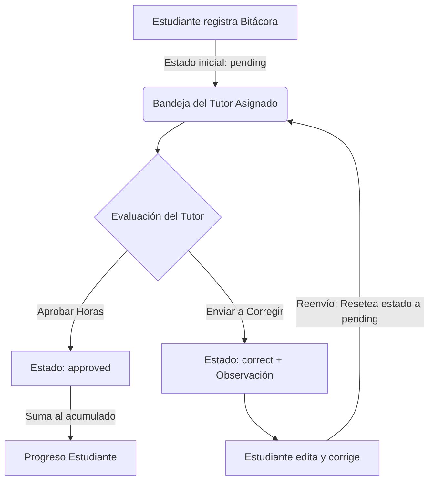

# Documentación del Sistema de Control de Servicio Comunitario - UNEFA

Este documento detalla la estructura, lógica y funcionamiento de todos los componentes del proyecto **Control de Servicio Comunitario**, desarrollado para la **Universidad Nacional Experimental Politécnica de la Fuerza Armada Nacional Bolivariana (UNEFA)**. El sistema está diseñado bajo una arquitectura cliente-servidor desacoplada para registrar, supervisar y auditar de forma interactiva las actividades comunitarias de los estudiantes.

---

## 1. Arquitectura General y Estructura del Proyecto

El proyecto se divide en dos directorios principales:
1.  **`client` (Frontend)**: Desarrollado en React, compilado con Vite y estilizado mediante CSS moderno (Glassmorphism y micro-animaciones).
2.  **`server` (Backend)**: API REST construida con Node.js y Express, comunicada con una base de datos relacional PostgreSQL.

### Árbol de Directorios del Proyecto

```text
Control Proyectos comunitarios/
├── client/                     # Código del Frontend (React + Vite)
│   ├── public/                 # Recursos públicos estáticos (favicon, etc.)
│   ├── src/
│   │   ├── assets/             # Recursos estáticos locales
│   │   ├── components/         # Componentes y Dashboards de la interfaz
│   │   │   ├── ActaModal.jsx             # Modal de configuración y descarga del acta PDF
│   │   │   ├── CoordinatorDashboard.jsx  # Interfaz del Coordinador General
│   │   │   ├── Header.jsx                # Encabezado dinámico de sesión
│   │   │   ├── Login.jsx                 # Pantalla de Login Premium (Cédula numérica)
│   │   │   ├── StudentDashboard.jsx      # Interfaz del Estudiante (Bitácoras, Hitos)
│   │   │   └── TutorDashboard.jsx        # Interfaz de Supervisión del Tutor (Auditorías)
│   │   ├── App.css             # Estilos de componentes específicos
│   │   ├── App.jsx             # Contenedor principal y enrutador lógico
│   │   ├── index.css           # Hoja de estilos global, tokens y Glassmorphism
│   │   └── main.jsx            # Punto de entrada de React
│   ├── index.html              # Plantilla HTML base
│   ├── package.json            # Dependencias del cliente (React, FontAwesome, etc.)
│   └── vite.config.js          # Configuración de Vite
├── server/                     # Código del Backend (Node.js + Express)
│   ├── assets/                 # Recursos gráficos institucionales (Logotipos)
│   │   ├── logo_ministerio.jpg # Logotipo del Ministerio en formato JPG
│   │   └── logo_unefa.svg      # Logotipo de la UNEFA en formato vectorial SVG
│   ├── db/
│   │   ├── index.js            # Configuración del Pool de PostgreSQL (pg)
│   │   └── schema.sql          # Estructura e inserciones semilla de la base de datos
│   ├── middleware/
│   │   └── auth.js             # Middlewares de seguridad (Validación JWT y Roles)
│   ├── routes/                 # Controladores y Endpoints de la API
│   │   ├── admin.js            # Operaciones administrativas del Coordinador
│   │   ├── auth.js             # Registro, Login y verificación del token
│   │   ├── cronograma.js       # Consulta del calendario académico
│   │   ├── proyectos.js        # Buscador de proyectos históricos
│   │   ├── reportes.js         # Rutas de bitácoras y generación de PDF final (Actas)
│   │   └── tutor.js            # Consulta de estudiantes asignados al tutor
│   ├── .env                    # Configuración de variables de entorno
│   ├── package.json            # Dependencias del servidor (Express, pg, JWT, Bcrypt, PDFKit, svg-to-pdfkit)
│   └── server.js               # Punto de entrada y servidor Express
└── DOCUMENTACION.md            # Este documento explicativo
```

---

## 2. Esquema y Estructura de la Base de Datos (PostgreSQL)

El archivo [`server/db/schema.sql`](file:///c:/Users/Maria%20Vasquez/Desktop/Control%20Proyectos%20comunitarios/server/db/schema.sql) define la estructura de las tablas de datos para el motor PostgreSQL 17:

### Tabla: `current_projects`
Define los proyectos comunitarios activos en los que participan los estudiantes.
*   `id` (SERIAL PRIMARY KEY): Identificador único.
*   `title` (VARCHAR): Nombre del proyecto.
*   `community_name` (VARCHAR): Nombre de la comunidad beneficiada.

### Tabla: `users`
Almacena la información de todos los usuarios (Estudiantes, Tutores y Coordinadores).
*   `id` (SERIAL PRIMARY KEY): Identificador único.
*   `name` (VARCHAR): Nombre completo del usuario.
*   `identification` (VARCHAR UNIQUE): Cédula de identidad nacional (clave de inicio de sesión).
*   `major` (VARCHAR): Carrera a la que pertenece el usuario.
*   `role` (VARCHAR): Rol en el sistema, limitado mediante `CHECK` a: `'student'` (estudiante), `'tutor'` (tutor académico) o `'coordinator'` (coordinador general).
*   `password_hash` (VARCHAR): Contraseña encriptada con `bcrypt`.
*   `active` (BOOLEAN DEFAULT TRUE): Estado de la cuenta (permite dar de baja usuarios sin borrar su historial).
*   `tutor_id` (INTEGER REFERENCES `users(id)`): Vincula a un estudiante con su tutor asignado.
*   `project_id` (INTEGER REFERENCES `current_projects(id)`): Vincula al estudiante con su proyecto activo.
*   `docs_submitted` (BOOLEAN): Control de entrega de documentos del estudiante.
*   `tutor_type` (VARCHAR): Tipo de tutor asignado (`'académico'` o `'institucional'`).

### Tabla: `activities`
Almacena el registro individual (bitácoras) de horas de servicio comunitario cargadas por los estudiantes.
*   `id` (SERIAL PRIMARY KEY): Identificador único de la actividad.
*   `student_id` (INTEGER REFERENCES `users(id)`): Referencia al estudiante que ejecutó la labor.
*   `activity_date` (DATE): Fecha en que se realizó la actividad.
*   `hours_spent` (INTEGER): Cantidad de horas invertidas, validado mediante `CHECK` entre 1 y 8 horas diarias.
*   `description` (TEXT): Resumen descriptivo de la tarea comunitaria realizada.
*   `physical_attendance` (BOOLEAN): Indica si la actividad fue presencial en la comunidad (`TRUE`) o a distancia (`FALSE`).
*   `spokesperson_name` (VARCHAR) & `spokesperson_phone` (VARCHAR): Datos de contacto del Vocero Comunal (bloque de Aval Comunitario para auditorías).
*   `sworn_statement` (BOOLEAN): Declaración jurada obligatoria aceptada por el alumno (`CHECK = TRUE`).
*   `status` (VARCHAR DEFAULT 'pending'): Estado de evaluación del reporte, restringido a:
    *   `'pending'`: Registrada por el estudiante, en espera de revisión del tutor.
    *   `'approved'`: Aprobada por el tutor. Las horas se suman al progreso formal del alumno.
    *   `'correct'`: Rechazada por observaciones. Requiere corrección y reenvío por parte del estudiante.
*   `feedback_comment` (TEXT): Observación o comentario escrito por el tutor detallando los motivos de una corrección.

### Tabla: `milestones`
Almacena los hitos del cronograma académico (fechas límite e inducciones).
*   `id` (SERIAL PRIMARY KEY)
*   `title` (VARCHAR): Título del hito.
*   `event_date` (DATE): Fecha pautada para el evento.
*   `project_id` (INTEGER REFERENCES `current_projects(id)`): Vínculo opcional con un proyecto específico.

### Tabla: `historical_projects`
Repositorio de proyectos antiguos para consulta y orientación.
*   `id` (SERIAL PRIMARY KEY)
*   `title` (VARCHAR): Título del proyecto comunitario aprobado.
*   `community` (VARCHAR): Ubicación o comunidad beneficiada.
*   `major` (VARCHAR): Carrera del estudiante que desarrolló el proyecto.
*   `summary` (TEXT): Resumen analítico del trabajo realizado.
*   `academic_year` (INTEGER): Año de culminación.

---

## 3. Seguridad, Lógica de Negocio y Flujo de Trabajo

### A. Autenticación y Autorización (JWT + Roles)
*   **Encriptación**: En el registro, la contraseña es procesada por `bcryptjs` con un factor de costo (`salt`) de 10.
*   **Generación del Token**: Al iniciar sesión con éxito en `/api/auth/login`, el servidor genera un **JSON Web Token (JWT)** que encapsula la información del usuario (ID, nombre, rol y carrera), firmado con una clave secreta (`JWT_SECRET`) y con un tiempo de expiración de 24 horas.
*   **Intercepción**: El cliente almacena este token en el `localStorage`. En cada petición posterior a la API, el token se envía en las cabeceras HTTP (`Authorization: Bearer <token>`).
*   **Validación**: El middleware [`server/middleware/auth.js`](file:///c:/Users/Maria%20Vasquez/Desktop/Control%20Proyectos%20comunitarios/server/middleware/auth.js) intercepta la petición, valida la autenticidad del token y extrae los datos del usuario. Adicionalmente, el middleware `checkRole` restringe el acceso de endpoints específicos comparando el rol activo del usuario contra los roles permitidos.

### B. Flujo de Control de Bitácoras (Estudiante <-> Tutor)
El proceso principal de aprobación de las 120 horas legales de servicio comunitario funciona de la siguiente manera:



1.  **Registro**: El estudiante envía una nueva actividad. El backend valida que los campos estén completos, que las horas estén en el rango de 1 a 8, y que se haya aceptado la declaración jurada. Se guarda en base de datos con estado `'pending'`.
2.  **Supervisión**: El tutor accede a su lista de alumnos asignados. A través de agregaciones en PostgreSQL (`SUM()`), visualiza el avance real acumulado de cada estudiante (solo sumando horas `'approved'`).
3.  **Acciones del Tutor**:
    *   **Aprobación**: Marca la bitácora como `'approved'`. Las horas reportadas se consolidan en el total del estudiante.
    *   **Observación**: Si la descripción no es lo suficientemente explícita, marca la bitácora como `'correct'` e ingresa un comentario con la observación.
4.  **Corrección**: El estudiante observa las observaciones en color rojo en su historial, activa el botón de "Editar y Corregir", lo que carga los datos en el formulario para modificarlos. Al guardar los cambios, la bitácora se actualiza, el estado vuelve a `'pending'` y el comentario de feedback se limpia (`NULL`) para una nueva revisión del tutor.

---

## 4. Generación de Actas de Evaluación Final en PDF

El sistema posee un módulo de generación de actas académicas en PDF implementado con `pdfkit` y `svg-to-pdfkit` en [reportes.js](file:///c:/Users/Maria%20Vasquez/Desktop/Control%20Proyectos%20comunitarios/server/routes/reportes.js).

### A. Formatos del Acta
*   **Vertical CON Título de Proyecto (Tipo 1)**: Orientación vertical (`portrait`). Imprime fechas de inicio y culminación y el título largo del proyecto.
*   **Vertical SIN Título de Proyecto (Tipo 2)**: Orientación vertical (`portrait`). Omite el título del proyecto comunitario.
*   **Horizontal (Tipo 3)**: Orientación apaisada (`landscape`). Muestra un "Período Académico" (ej. 2026-I) en lugar de fechas exactas.

### B. Elementos del Diseño en PDFKit
*   **Logotipos en Cabecera**:
    *   *Izquierda (Ministerio)*: Intenta cargar el archivo de imagen `logo_ministerio.jpg` desde la carpeta `assets`. En caso de fallo o ausencia, utiliza un recuadro de respaldo geométrico.
    *   *Derecha (UNEFA)*: Intenta leer el archivo vectorial `logo_unefa.svg` de la carpeta `assets`. El sistema realiza una limpieza regex para omitir propiedades de ancho/alto absoluto (ej. `350mm`) para que la librería escale el elemento simétricamente a la caja del viewport (`80x40`) en la cabecera.
*   **Textos Centrados**: Se definieron márgenes de dibujo estrictos (X=50, ancho de cabecera completo) para forzar a PDFKit a centrar los títulos institucionales en lugar de heredar las coordenadas del logotipo de la derecha.
*   **Separación de Nombres**: Se incluye un split inteligente sobre el campo único de nombre en base de datos, separando las palabras del estudiante para distribuirlas correctamente en las columnas independientes de `APELLIDOS` y `NOMBRES` requeridas en la tabla de actas.
*   **Líneas de Firma y Autoridades**:
    *   *En Formato Horizontal (Tipo 3)*: Imprime una **única firma centrada** al final de la página para el `RESPONSABLE DE PROYECTO COMUNITARIO` (nombre y C.I. ingresados en el modal).
    *   *En Formatos Verticales (Tipos 1 y 2)*: Imprime **tres firmas**:
        1.  `Tutor Académico` (Consultado de forma dinámica desde base de datos con nombre y C.I. del docente asignado al proyecto).
        2.  `Jefe de Área Académica` (Pasado desde el modal, con nombre y C.I.).
        3.  `Responsable del Servicio Comunitario` (Pasado desde el modal, con nombre y C.I.).
    *   Todas las firmas incorporan de manera explícita el número de Cédula de identidad debajo de su respectivo cargo.

---

## 5. Componentes del Frontend (React + CSS)

### A. Enrutador y Sesión: [`client/src/App.jsx`](file:///c:/Users/Maria%20Vasquez/Desktop/Control%20Proyectos%20comunitarios/client/src/App.jsx)
Carga el token desde el `localStorage` y valida la sesión del usuario. Carga de manera dinámica el layout adecuado para Estudiante, Tutor o Coordinador.

### B. Login y Campo Cédula: [`client/src/components/Login.jsx`](file:///c:/Users/Maria%20Vasquez/Desktop/Control%20Proyectos%20comunitarios/client/src/components/Login.jsx)
Diseñado con efectos de Glassmorphism. El campo de cédula utiliza `type="text"`, `inputMode="numeric"`, `pattern="[0-9]*"` y un filtro regex en `onChange` para aceptar únicamente caracteres numéricos, **eliminando las flechas (spinners) nativas y desactivando el scroll wheel** que entorpecía el ingreso de datos.

### C. Modal de Actas: [`client/src/components/ActaModal.jsx`](file:///c:/Users/Maria%20Vasquez/Desktop/Control%20Proyectos%20comunitarios/client/src/components/ActaModal.jsx)
Se abre desde el Panel de Coordinador al seleccionar un proyecto comunitario activo.
*   *Formulario Estilizado*: Caja Glassmorphism compacta con transiciones suaves en botones.
*   *Campos Dinámicos*: Muestra el input de "Período Académico" únicamente si el tipo de acta seleccionado es Horizontal, de lo contrario, solicita "Fecha de Inicio" y "Fecha de Culminación".
*   *Campos de Autoridades*: Grid compacto de entradas para los nombres y números de Cédula del Jefe de Área Académica y Responsable del Servicio Comunitario (eliminando campos innecesarios como el de Extensión).
*   *Función de Descarga*: Recopila la información, realiza una petición `POST` al endpoint `/api/reportes/generar-acta` con el JSON correspondiente, procesa la respuesta HTTP como un Blob y descarga el archivo automáticamente en el navegador con un link temporal.

---

## 6. Endpoints de la API REST

### Módulo: Autenticación (`/api/auth`)
*   `POST /register`: Registra un usuario nuevo en el sistema.
*   `POST /login`: Valida las credenciales y firma un JWT de sesión.
*   `GET /me`: Obtiene los datos del usuario en sesión activa.

### Módulo: Reportes y Bitácoras (`/api/reportes`)
*   `GET /estudiante`: (Estudiante) Retorna el listado de bitácoras del alumno y los consolidados acumulados.
*   `POST /`: (Estudiante) Crea una nueva actividad.
*   `PUT /:id`: (Estudiante) Edita una actividad cargada.
*   `PUT /:id/comentario`: (Tutor) Permite evaluar una actividad (`'approved'` / `'correct'`) y añadir el feedback respectivo.
*   `POST /generar-acta`: (Coordinador) Genera y descarga el PDF del acta final de evaluación del proyecto con el formato institucional correspondiente (Logos e incrustación de firmas).
